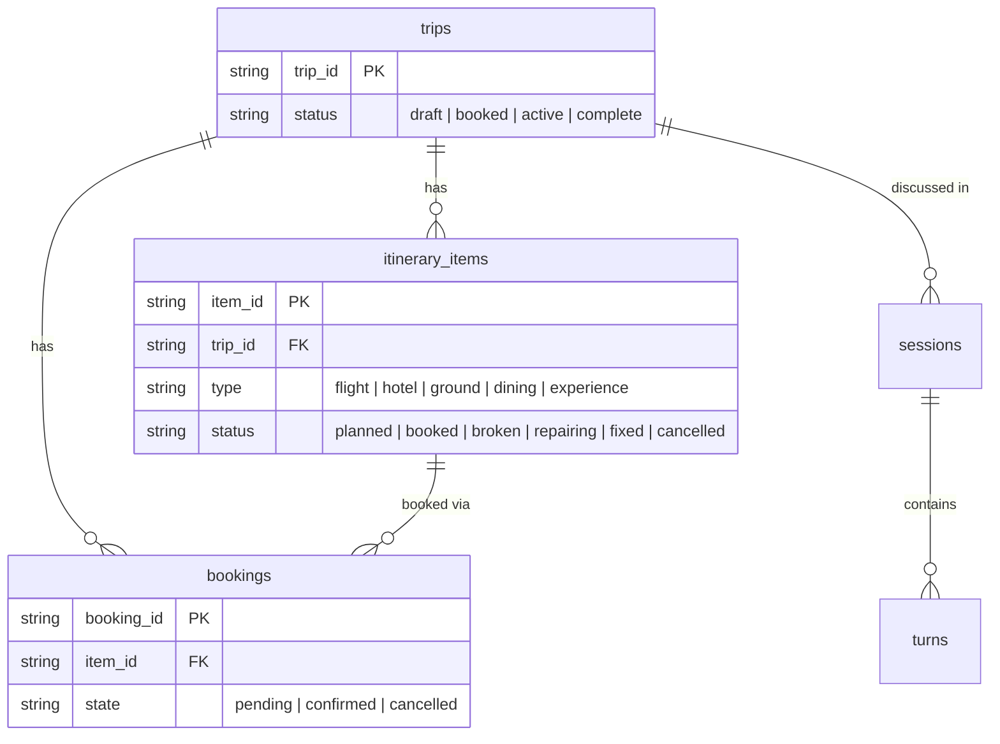

# Cascade Repairer

ML-powered travel recovery. When a flight cancels, Cascade keeps talking while it repairs the downstream trip — hotel, ride, dinner, tour — in parallel. The itinerary flips from **broken → repairing → fixed** on screen. A trained delay-risk model ranks replacement flights; a separate action-policy model ranks ground-transport moves on the itinerary you already have.

- Dashboard: http://localhost:1019/v1/cascade/
- Optimize My Trip: http://localhost:1019/v1/build/
- Live: https://talktomytrip.com/?code=cascade2026 (the `?code=` query is required)

## Problem

A cancelled flight is not a search problem. It is a ranking problem under stress: which alternative actually gets you there with the least chance of breaking again? Travelers bounce across tabs for times, prices, and rides, and still cannot see delay risk or how a later arrival hits the rest of the day.

## Solution

Cascade is a conversational recovery agent on a live itinerary.

1. Speech becomes structured tools (search, preferences, trip status, repair).
2. Sabre InstaFlights supplies priced alternatives (real CERT shopping; PNR writes are mock where entitlements block create).
3. A logistic regression scores P(arrival delay ≥ 15 min) on every option.
4. A preference ranker mixes that risk with price, arrival, stops, and duration.
5. You hear and see *why* — “24% disruption risk, nonstop, lands at 8:50 AM.”
6. “Price matters more” or “arrive before 9” reranks the **same** options. No second search.

The LLM explains. The models decide.

## Build & run locally

Commands run from the **repo root** (`Makefile`, `docker-compose.yml`, `config/.env`).

**1. Install Docker.** [Docker Desktop](https://docs.docker.com/get-started/get-docker/) includes Compose. `make` ships with macOS/Linux.

**2. Create `config/.env`.** Compose injects this file and will not start without it:

```bash
cp backend/.env.example config/.env
```

Placeholder values boot the stack. Add keys only for the surfaces you exercise:

| Variable | Needed for |
|----------|------------|
| `OPENAI_API_KEY` | Concierge / agent endpoints, Whisper STT / TTS |
| `FEATHERLESS_API_KEY` | Spoken-text LLM. Unset → OpenAI `gpt-5.4-mini`. STT/TTS stay on OpenAI. |
| Voice API key + web agent ID | Voice orb on Cascade / Optimize (`/v1/web_call/token`) |
| Caller agent ID + callee phone | Outbound consent / results callbacks |
| `SABRE_*` + `SABRE_MODE` | Flight shopping (`mock` or `real`) |
| `GOOGLE_MAPS_API_KEY` | Live directions on Optimize My Trip (unset → labeled demo geometry) |
| `UBER_SERVER_TOKEN` | Live first-stop fares (unset → no live prices) |
| `RESEND_API_KEY` | Itinerary email |
| `DEMO_ACCESS_CODE` | Gate on `/v1/*` JSON (unset → fail-open for local dev) |

**3. Build and start:**

```bash
make up
```

- Backend (FastAPI, hot-reload): http://localhost:1019/v1/cascade/
- Health: http://localhost:1019/v1/hello/hello_world

`make logs`, `make down`, `make clean`, `make backend` — see `make help`.

Tests (hermetic — no GCP or LLM keys):

```bash
docker compose build backend
docker compose run --rm backend python -m pytest tests/ -v
```

## Repo layout

| Path | What it is |
|------|------------|
| `backend/` | FastAPI app: Concierge, repair cascade, Sabre, email, tests |
| `backend/ml/` | Delay-risk training + inference. Artifact in `backend/ml/artifacts/` |
| `backend/ml/transport/` | Ground-transport quality + action-policy models |
| `backend/api/assets/cascade/` | Live dashboard |
| `backend/api/assets/build/` | Optimize My Trip |
| `specs/` | Mission, tech stack, roadmap, per-feature specs |
| `ios/TalkToMyTrip/` | Native SwiftUI companion (optional) |

## Stack

- **Backend:** Python / FastAPI, Docker Compose + Makefile
- **Agent:** OpenAI Agents SDK (function tools). Spoken text via Featherless when configured
- **Voice:** WebRTC orb on the dashboard; every substantive turn POSTs to `/v1/web_call/query` (or `/v1/trip_builder/query` on Optimize). The voice layer does not pick flights
- **Inventory:** Sabre InstaFlights
- **ML:** scikit-learn logistic regression (delay risk) + random-forest action policy (hops)
- **Data:** BigQuery trips / items / bookings; GCS for audio artifacts
- **Maps / rides:** Google Directions and Uber estimates when keys exist; otherwise named demo fallbacks

## Machine Learning

### Flight delay risk

**Target.** P(arrival delay ≥ 15 minutes) — BTS On-Time definition. Example: `predicted_delay_risk = 0.18`.

**Data.** BTS-calibrated synthetic On-Time set (`backend/ml/data.py`): ~18% national delay rate, hotter evening banks, connections, congested hubs, carrier differences. Optional `--csv` for a real labeled file. CI never downloads a giant BTS dump.

**Features.** Departure/arrival hour, day of week, month, stops, duration, connection flag, evening/early flags, hub pressure, airline.

**Model.** `LogisticRegression` in a sklearn pipeline (median impute, scale, one-hot airline). Trains in seconds, coefficients are readable, no GPU.

```bash
docker compose exec backend python -m ml.train
```

Writes `backend/ml/artifacts/delay_risk.joblib` and `metrics.json`. Requests never retrain.

**Hold-out** (2,400 flights from 12,000):

| Metric | Value |
|--------|-------|
| ROC-AUC | 0.76 |
| Accuracy | 0.69 |
| Precision | 0.44 |
| Recall | 0.69 |
| F1 | 0.54 |
| Delay rate in test set | 26% |

Precision is 0.44 because delay is the minority class — ranking uses the **probability**, not the hard label. Live numbers: `GET /v1/ml/metrics` and the cascade “Available flights” panel.

**Inference.** `ml.inference.predict_delay_risk` loads once per process. Missing artifact → documented `heuristic_fallback` so a voice turn cannot die.

### Optimize My Trip — action-selection model

Cascade starts with the itinerary you already have. Upload a PDF, screenshot, or pasted schedule at http://localhost:1019/v1/build/.

Maps answers *what routes exist*. A trained forest answers *which action to take* (change pickup, provider, mode, leave earlier, reorder stops). Hard constraints (`Prefs`: max walk, min buffer, frozen stops) filter first. Voice extracts preferences and explains — it does not pick the winner.

**Target.** `action_utility` for (current hop + candidate action). The loop executes the highest-scoring feasible action, then re-observes (up to 5 steps). Route reorder is a constrained permutation of flexible interior stops (ends and `anchored` items stay put); it is proposed only if path miles drop by ~8%+, then scored as `REORDER_ACTIVITY` like any other action.

**Data.** Synthetic urban hops with a documented DGP (`backend/ml/transport/data.py`, `policy.py`). Not real Uber/Lyft outcome labels. Simulated quotes are tagged `demo_simulated`. Unset Maps key → `demo_geometry`.

```bash
docker compose exec backend python -m ml.transport.train
docker compose exec backend python -m ml.transport.policy_train
```

**Action model (hold-out):** action accuracy **0.69** vs rules baseline **0.19** and linear **0.59**; R² **0.94**. See `GET /v1/ml/transport/policy` — UI reads the artifact, never hardcodes the numbers.

## AI agent

The Concierge at `/v1/web_call/query`:

1. Extracts origin, destination, date, and constraints.
2. Calls `search_flights` (Sabre InstaFlights).
3. Scores each itinerary with the delay-risk model, then ranks with traveler prefs (default: lowest disruption risk).
4. Speaks the recommendation **and the delay percent from the model** — it must not invent percentages.
5. On “I’d rather pay less” / “avoid connections” / “arrive before 9”, calls `set_recovery_preferences` and reranks the **same** stored options.
6. Auto-repair (`fix_trip`) ranks remaining candidates by low delay risk plus arrival closeness to the cancelled flight.

Sessions pin a `trip_id` (book, disrupt, or POST body). The dashboard polls `GET /v1/itinerary/status/{trip_id}` every 1.5s on the same rows the tools write.

## Demo script (flight recovery)

On http://localhost:1019/v1/cascade/, tap the orb:

1. “My flight was canceled. I need to get from JFK to LAX tomorrow morning.”
2. Cards appear with **Recommended** + disruption risk.
3. “Actually, price matters more.” → cheaper (often connecting) option rises; the agent names the higher delay risk.
4. “Never mind — I really need to arrive before 9 AM.” → earliest option that makes the window.
5. Book with “option one” if you want the full repair beat.

## Demo script (Optimize My Trip)

On http://localhost:1019/v1/build/:

1. **Try sample San Francisco weekend** or upload a PDF / screenshot.
2. Stages: parse → maps → rideshare → ML action loop. Header shows original vs optimized travel minutes.
3. Say **optimize my trip for time**, **best option for first stop**, **why did you choose that?**, or **undo that change**.
4. **Apply** / **Keep current** on route-reorder and transportation cards. **Model Intelligence** shows hold-out accuracy from `policy_metrics.json`.

## Database

Six tables in BigQuery (`us-west1`). Schema: [`specs/tech-stack.md`](specs/tech-stack.md). Typed repositories in `backend/api/repositories/`.



The **booked → broken → repairing → fixed** lifecycle drives both the repair agent and the live UI.

## The one-page demo: `/v1/cascade/`

1. **Book by voice** — orb → Concierge → InstaFlights options → mock PNR. Trip appears on the page within ~4 s.
2. **Cancel flight → cascade** — breaks the flight (screen turns red) and places **Call 1** asking consent. No repairs at click time.
3. **Spoken “yes”** launches parallel repairs. The 60-second timer starts at the go-ahead. No / timeout stands down and re-arms Cancel.
4. **Call 2** reports the actual rebooked flight, price delta, and (if cheaper and PayPal is configured) a sandbox refund sentence. Optional email of the repair summary.

Mid-repair, “how’s my trip?” uses `trip_status` against live item rows. **Sabre Live Search** in the right column is the shopping ring buffer.

Local mock (`SABRE_MODE=mock`, voice env unset): page still serves; drive the agent with `POST /v1/web_call/query` and watch the page adopt the trip. Disrupt endpoints 503 without outbound-call env.

### Operator run sheet

Access-gated JSON needs `X-Access-Code` (browser `?code=` persists to localStorage).

```
https://talktomytrip.com/v1/cascade/?code=cascade2026
```

1. **New trip** if a trip is already pinned (a pinned session will not book).
2. Book JFK→LAX (or whichever pair the probe below marks live) and accept “arrange the rest of the trip.”
3. Optional: “is there a way to get home?” — schedule indication, not bookable fares.
4. Optional: email offer — confirm the spelled local-part; mail is `Cascade <info@talktomytrip.com>`.
5. **Cancel flight → cascade** once. Answer **yes** on Call 1. Cards animate; Call 2 follows (~35 s).

```bash
BASE="https://talktomytrip.com"
CODE="cascade2026"
curl -s -H "X-Access-Code: $CODE" "$BASE/v1/itinerary/status/<TRIP_ID>" | python3 -m json.tool
curl -s -H "X-Access-Code: $CODE" "$BASE/v1/sabre_tools/latest_trip_id"
curl -s -H "X-Access-Code: $CODE" "$BASE/v1/sabre_tools/search_log"
```

### Check which flight pairs are live

InstaFlights is a per-pair cache with a per-pair advance-purchase window. Empty is a documented 404, not a bug. Re-probe within the hour before a demo:

```bash
BASE="https://talktomytrip.com"
CODE="cascade2026"
DEMO_DATE="July 18 2026"
RUN="$(date +%s)"; i=0
for PAIR in "SFO to MIA" "SEA to BOS" "BOS to SEA" "JFK to LAX" "JFK to ORD" \
            "ATL to SEA" "LAX to MSP" "DFW to EWR" "MCO to JFK" "SEA to PDX"; do
  i=$((i+1))
  REPLY=$(curl -s -X POST "$BASE/v1/web_call/query" \
    -H "Content-Type: application/json" -H "X-Access-Code: $CODE" \
    -d "{\"query\": \"Search flights from $PAIR on $DEMO_DATE\", \"session_name\": \"probe-$RUN-$i\"}" \
    | python3 -c "import sys,json; print(json.load(sys.stdin).get('response',''))")
  case "$REPLY" in
    *"I found"*) echo "LIVE     $PAIR" ;;
    *"couldn't find"*|*"couldn’t find"*) echo "empty    $PAIR" ;;
    *"can't search"*|*"can’t search"*) echo "unsupported  $PAIR" ;;
    *) echo "other    $PAIR" ;;
  esac
done
```

Use a unique `session_name` per probe or the agent replays prior options.

## Deployment

Cloud Run, `us-west1`:

- Live: https://talktomytrip.com/?code=cascade2026
- Health: `GET /v1/hello/gcp_check`

CI (Cloud Build): validate config → BigQuery dataset → image → pytest in the image → deploy. See `backend/devops/README.md`.

## Sabre client secret (from the raw user/secret pair)

```bash
set -a && . ./config/.env && set +a
python3 - <<'PY'
import base64, os
b64 = lambda s: base64.b64encode(s.encode()).decode()
print(b64(f"{b64(os.environ['SABRE_API_USER_ID'])}:{b64(os.environ['SABRE_API_SECRET'])}"))
PY
```
