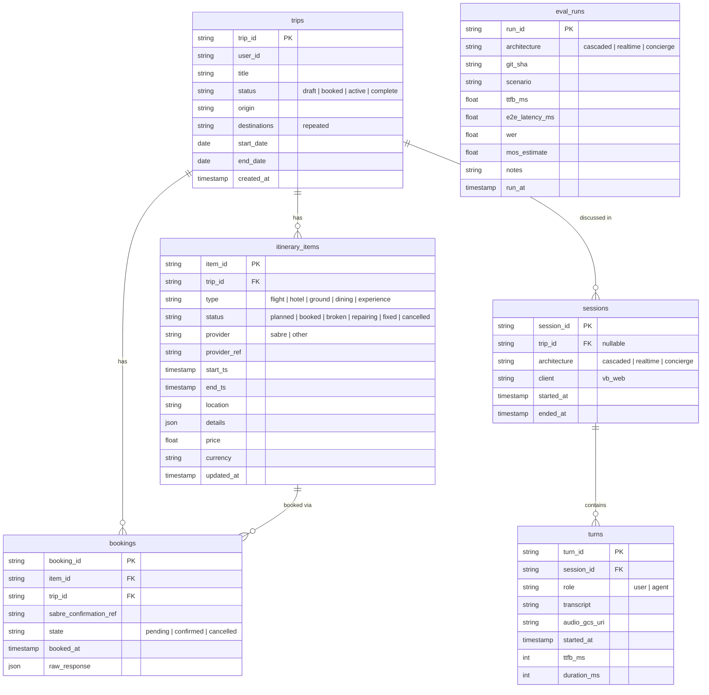

# Vocal Bridge Training — hackathon-ready voice-agent foundation

This repo is the pre-built foundation for the **DeepLearning.AI Voice AI Hackathon — "The Complete Trip," powered by Sabre and Vocal Bridge** (July 18, 2026, Mountain View, CA). The challenge: pull a fragmented trip — flights, hotels, ground transport, dining — into a single voice conversation and a single itinerary, booked and managed by a voice AI agent. Everything infrastructural (voice architectures, agent layer, deployment, evaluation) is built *before* event day, so the team spends hackathon hours on the idea, not the plumbing.

**The team's demo concept is locked** (2026-07-06): the **Cascade Repairer** — a flight cancels live, and the voice agent keeps talking while it repairs the whole downstream trip (hotel, ride, dinner, tour) in parallel, the itinerary flipping from broken to fixed on screen. Full mission and scope: [`specs/mission.md`](specs/mission.md).

## Build & run locally

All commands below run from the **repo root** — that's where the `Makefile` and `docker-compose.yml` live, and where Compose resolves the `config/.env` path from.

**1. Install Docker.** Get [Docker Desktop](https://docs.docker.com/get-started/get-docker/) (it includes Docker Compose) and make sure it's running. `make` ships with macOS/Linux.

**2. Create `config/.env`.** Docker Compose injects this file into both containers and refuses to start without it. Copy the template and fill in what you have:

```bash
cp backend/.env.example config/.env
```

The stack boots fine with placeholder values — you only need real keys for the endpoints you exercise:

| Variable | Needed for |
|----------|------------|
| `OPENAI_API_KEY` | Agent endpoints (`/v1/hello/agents*`), cascaded pipeline (`/v1/cascade_demo`) |
| `VOCAL_BRIDGE_API_KEY`, `VOCAL_BRIDGE_AGENT_ID` | Voice smoke-test page (`/v1/vb_test/`) |
| `VOCAL_BRIDGE_CALLER_AGENT_ID`, `VOCAL_BRIDGE_CALLEE_PHONE` | Outbound-call tool (`/v1/outbound_call`) |

**3. Build the images.** `config/.env` must exist before this step — Compose loads it at build/start time and errors out if it's missing:

```bash
make build          # = docker compose build (both images)
```

To build just one image, or force a clean rebuild of the Jupyter image after a base-image change:

```bash
docker compose build backend
make rebuild-jupyter
```

**4. Start the stack** (`make up` also builds, so you can skip step 3 and run this directly):

```bash
make up
```

- Backend (FastAPI, hot-reload): http://localhost:1019/v1/hello/hello_world
- JupyterLab (course notebooks): http://localhost:8020/?token=vb

Other useful targets (`make help` lists them all): `make logs` tails everything, `make down` stops the stack, `make clean` also removes volumes and locally-built images, and `make backend` / `make jupyter` start one service alone.

Run the test suite the same way CI does — inside the built container:

```bash
docker compose build backend
docker run --rm vocal-bridge-training-backend python -m pytest tests/ -v
```

Tests are hermetic: no GCP credentials or `OPENAI_API_KEY` required. The agent endpoints (`/v1/hello/agents*`) do need `OPENAI_API_KEY` set in the environment to return live results.

## Repo layout

| Path | What it is |
|------|------------|
| `backend/` | FastAPI app (Docker): OpenAI Agents SDK endpoints, BigQuery/GCS helpers, MCP servers, devops + promotion scripts, tests |
| `jupyter_notebook/` | Dockerized JupyterLab with the reworked DeepLearning.AI course notebooks (L2–L5), glossary, and transcript — the reference source for all voice code |
| `specs/` | Project constitution (mission, tech stack, roadmap) and per-feature specs — spec-driven development lives here |
| `skills/` | Agent skills (source of truth; `make copy-skills` mirrors them into `.claude/skills/` and `.agents/skills/`) |
| `AGENTS.md` | Working rules for AI agents contributing to this repo |
| `TODO.md` | Ideas inbox — not authoritative; the roadmap is |

## Stack at a glance

- **Backend:** Python / FastAPI, containerized; local orchestration via `docker-compose.yml` + `Makefile`.
- **Agent layer:** **OpenAI Agents SDK** (agents, function tools, MCP servers) — patterns proven in `backend/api/hello.py` and documented in `skills/openai-agents-sdk/`. Deliberately not Anthropic.
- **Voice:** Vocal Bridge web client (WebRTC) in front of three course architectures — cascaded (STT → LLM → TTS), real-time voice-to-voice, and the hybrid "Concierge" pattern (demo target) — ported from the L2–L5 notebooks as the roadmap progresses.
- **Data:** BigQuery (dataset `vocal_bridge`) for trips/itineraries/conversations/evals, GCS for audio artifacts — both via config-driven helpers in `backend/api/helpers/`.
- **Travel APIs:** Sabre (hackathon requirement) — mocked docs-accurate first, real credentials swapped in at the event.

Details and decisions: [`specs/tech-stack.md`](specs/tech-stack.md).

## Course integration patterns

The course teaches three patterns for where voice plugs into a product. These are distinct from the cascaded, real-time, and Concierge voice architectures above:

1. **Voice embedded in applications (Voice for your application).** Voice and the GUI share bidirectional state: spoken commands can trigger UI changes, while clicks and other UI actions remain visible to the voice agent. The course calls this the **Client Actions** pattern and demonstrates it in Lesson 2 (`jupyter_notebook/training_course/L2/`).
2. **Voice for existing agents.** Vocal Bridge acts as a thin voice layer in front of an existing GPT, Claude, LangChain, or other LLM agent. It handles conversational flow itself and delegates queries that need the existing agent's reasoning, tools, or domain logic. Lesson 3 demonstrates this with `useAIAgent`; the backend reference surface is `/v1/web_call/`.
3. **Voice as a tool.** An LLM agent invokes voice when a phone call or live conversation is the right modality, just as it would call any other tool. Lesson 4 demonstrates outbound calling with `vb call`; the backend reference surface is `/v1/outbound_call`.

> **Pattern used by the Cascade Repairer demo:** [`backend/api/demo.py`](backend/api/demo.py) uses the outbound-calling capability associated with **Voice as a tool**, but it is not a strict implementation of that pattern. Both demo beats invoke `vb_cli.place_call` to make a proactive outbound call: first to confirm the booking, then to report the cancellation while repairs run in the background. The calls are triggered deterministically by the operator-facing demo orchestrator rather than selected as a tool by an LLM. The demo is therefore closest to Pattern 3, but does not fully implement any of the three course integration patterns. Its live itinerary is a coordinated visual surface, not the Client Actions pattern, because the phone agent and UI do not share bidirectional WebRTC state.

The canonical course wording and definitions live in [`COURSE_TRANSCRIPT.md`](jupyter_notebook/training_course/COURSE_TRANSCRIPT.md) and [`COURSE_GLOSSARY.md`](jupyter_notebook/training_course/COURSE_GLOSSARY.md).

## Database structure

Six tables in the BigQuery dataset `vocal_bridge` (us-west1). Schema source of truth: [`specs/tech-stack.md`](specs/tech-stack.md) § Schema; typed pydantic models + one repository module per table live in `backend/api/repositories/`. Tables are created idempotently by CI on every build and never dropped.



The `itinerary_items.status` lifecycle (**booked → broken → repairing → fixed**) is what drives the Cascade Repairer demo — the agent's repair logic and the live itinerary UI both key off it. `eval_runs` stands alone: one row per evaluation-harness run, not tied to a trip.

## Deployment

The backend runs on **Cloud Run** (GCP project `vocal-bridge-hackathon`, `us-west1`):

- Dev service: https://vocal-bridge-be-dev-24105435206.us-west1.run.app/
- Health check: `GET /v1/hello/gcp_check` — verifies BigQuery and GCS reachability independently.

CI/CD is Cloud Build, driven by `backend/config.yaml` + `backend/devops/cloudbuild.yaml`: validate config → ensure BigQuery dataset → build image → **pytest inside the built image** (failure blocks the deploy) → deploy. The pipeline fires on a **GitHub PR from a `vb/feature/*` branch into `vb/dev`** — direct pushes do not build. Provisioning and console-only setup steps: [`backend/devops/README.md`](backend/devops/README.md).

## The one-page demo: `/v1/cascade/` (Phase 23)

The complete book → break → consent → repair → callback experience runs from the
cascade dashboard, with Josh as both operator and traveler:

1. **Book by voice, free of quota** — tap the center-column orb (the
   `/v1/web_call/` wiring on-page) and book through the guided Concierge flow;
   real InstaFlights fares on live pairs, mock PNR writes. The booked trip
   auto-appears on the page within ~4 s.
2. **Cancel flight → cascade** does two things only: breaks the flight (screen
   turns red) and places **Call 1**, which describes the real trip and asks the
   traveler for consent to repair. **No repairs launch at click time** — the
   page shows "waiting for the traveler's go-ahead" with no running clock.
3. **The spoken "yes" launches the repairs**: a backend watcher polls the VB
   session log for Call 1's transcript, LLM-classifies the answer, and only an
   unambiguous yes fires the cascade — the 60-second recovery timer starts
   here, at the go-ahead. No/ambiguous/timeout stands down on-page and re-arms
   the Cancel trigger.
4. **Call 2 — the results callback** — fires when the backend's repair tasks
   land (~35 s), its script composed from the actual repair results (rebooked
   flight, price delta, re-checked legs).

Quota: **2 calls per full run** (booking is web-voice, free). Mid-repair, ask
the orb "how's my trip?" — the Concierge's `trip_status` tool reads the live
statuses across sessions. The right column's **Sabre Live Search** panel shows
the shopping layer's recent operations (route, real/mock/fallback, outcome).

Local mock walkthrough (zero quota, `SABRE_MODE=mock`, VB env unset): the page
serves at `/v1/cascade/`, booking works through the orb only with VB env set —
without it, drive the Concierge via the `/v1/web_call/query` curl seam and
watch the page adopt the trip; the disrupt endpoints 503 cleanly without the
VB env.

## Demo-day: check which flight pairs are live

The guided-booking and repair flows shop **real** Sabre fares (`SABRE_MODE=real`
on the deployed service) via InstaFlights. InstaFlights is a **per-pair cache**
with a **per-pair advance-purchase window**, so at any given moment only *some*
origin→destination pairs have priced content — the rest honestly return "no
flights." That live set **drifts**: it changes as the cache refreshes and **as
the UTC day rolls** (00:00 UTC = 5 PM PDT). A pair that returns options in the
morning can be empty an hour later, and a pair that was live yesterday is not
guaranteed today. **A green result yesterday proves nothing about the demo.**

So before every rehearsal — and again right before the live demo — probe the
current set and pick a pair (and date) that comes back with options. This runs
entirely against the **deployed Cloud Run service** through the same voice path
the demo uses; no local setup, just the shared access code. Adjust `DEMO_DATE`
to the departure date you'll speak in the demo (near-term dates — a couple of
days out — are the most likely to be cached):

```bash
BASE="https://vocal-bridge-be-dev-24105435206.us-west1.run.app"
CODE="cascade2026"                 # the DEMO_ACCESS_CODE on the service
DEMO_DATE="July 18 2026"           # the date you'll actually say in the demo

# Curated demo shortlist (from specs/2026-07-13-sabre-cert-exploration/sabre-cert-notes.md).
# Each probe MUST use a unique session_name — reusing one makes the agent replay the
# prior conversation ("I already have options…") instead of searching. epoch+counter
# guarantees uniqueness; do NOT use $RANDOM (it can collapse to a constant in a shell).
RUN="$(date +%s)"; i=0
for PAIR in "SFO to MIA" "SEA to BOS" "BOS to SEA" "JFK to LAX" "JFK to ORD" \
            "ATL to SEA" "LAX to MSP" "DFW to EWR" "MCO to JFK" "SEA to PDX"; do
  i=$((i+1))
  REPLY=$(curl -s -X POST "$BASE/v1/web_call/query" \
    -H "Content-Type: application/json" -H "X-Access-Code: $CODE" \
    -d "{\"query\": \"Search flights from $PAIR on $DEMO_DATE\", \"session_name\": \"probe-$RUN-$i\"}" \
    | python3 -c "import sys,json; print(json.load(sys.stdin).get('response',''))")
  case "$REPLY" in
    *"I found"*)          echo "✅ LIVE     $PAIR — $REPLY" ;;
    *"couldn't find"*|*"couldn’t find"*) echo "⚪ empty    $PAIR" ;;
    *"can't search"*|*"can’t search"*)   echo "🚫 unsupported route  $PAIR" ;;
    *)                    echo "❓ other    $PAIR — $REPLY" ;;
  esac
done
```

Reading the output:
- **✅ LIVE** — the agent said "I found N options"; this pair+date is bookable
  right now. Use one of these in the demo.
- **⚪ empty** — supported pair, but no cached content for that date (the honest
  no-flights line). Try a different date or pair.
- **🚫 unsupported route** — the pair isn't in the sandbox's supported markets at
  all (e.g. MSP→MCI); don't script it.

Pick a **LIVE** pair and speak that exact route and date in the demo (`/v1/web_call/`
or the phone flow). Because the set drifts, **re-run this within the hour before
you present**, not the night before.

> Note: this is the manual form of the "event-day-morning Sabre smoke" on the
> roadmap (Phases 24/29). A turnkey endpoint that sweeps this automatically is
> planned but not yet built — until then, this curl loop is the day-of check.

## Shipping a PR — evidence required

`git_pull_dev.sh` (commit → push → PR → merge → sync) refuses to merge unless the
PR description carries three evidence sections — `### Mock walkthrough`,
`### Live run`, and `### Pytest` — with the auto-generated placeholder replaced
(Phase 31: a non-empty-only check let four phases merge with placeholder bodies).
Write the evidence into `PR_BODY.md` at the repo root (gitignored) and the script
uses it as the description verbatim; `SKIP_EVIDENCE=1` bypasses the guard, loudly,
for PRs with no runtime surface.

## Create Sabre secret 
set -a && . ./config/.env && set +a
python3 - <<'PY'
import base64, os
b64 = lambda s: base64.b64encode(s.encode()).decode()
print(b64(f"{b64(os.environ['SABRE_API_USER_ID'])}:{b64(os.environ['SABRE_API_SECRET'])}"))
PY
