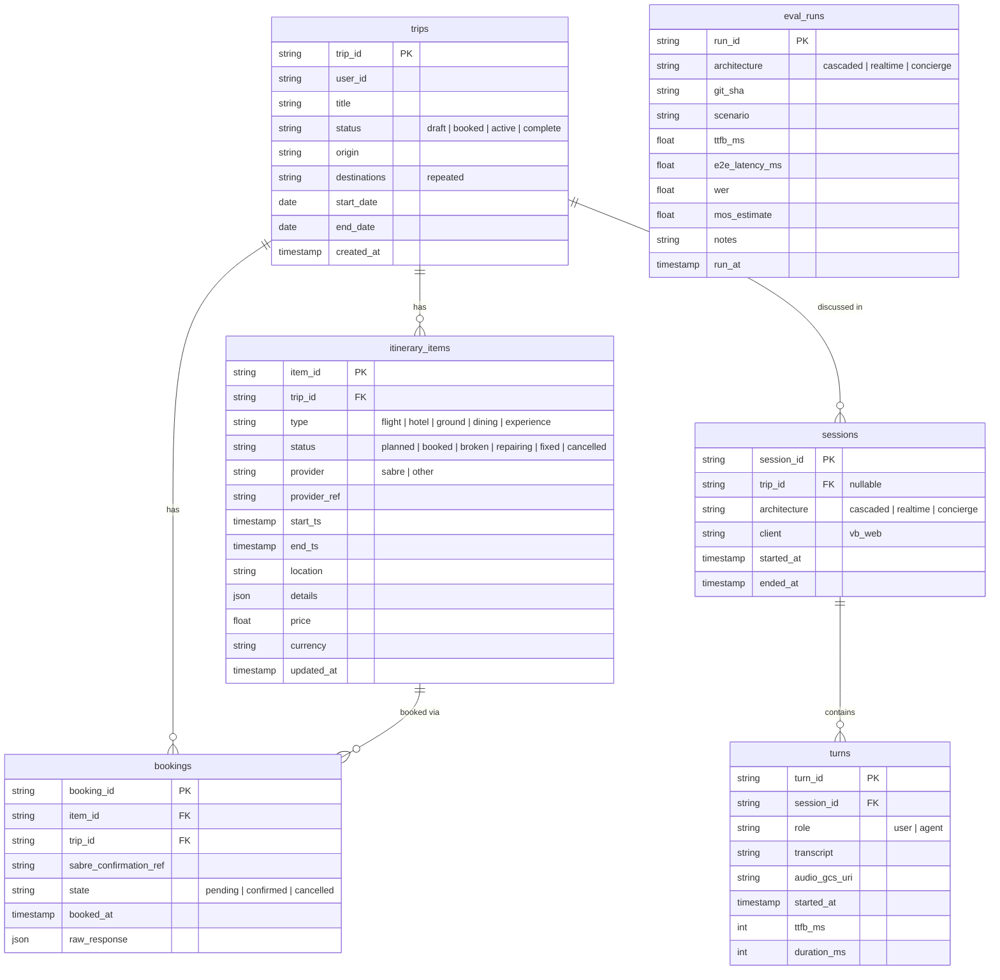

# Vocal Bridge Training — hackathon-ready voice-agent foundation

This repo is the pre-built foundation for the **DeepLearning.AI Voice AI Hackathon — "The Complete Trip," powered by Sabre and Vocal Bridge** (July 18, 2026, Mountain View, CA). The challenge: pull a fragmented trip — flights, hotels, ground transport, dining — into a single voice conversation and a single itinerary, booked and managed by a voice AI agent. Everything infrastructural (voice architectures, agent layer, deployment, evaluation) is built *before* event day, so the team spends hackathon hours on the idea, not the plumbing.

**The team's demo concept is locked** (2026-07-06): the **Cascade Repairer** — a flight cancels live, and the voice agent keeps talking while it repairs the whole downstream trip (hotel, ride, dinner, tour) in parallel, the itinerary flipping from broken to fixed on screen. Full mission and scope: [`specs/mission.md`](specs/mission.md).

## Build & run locally

All commands below run from the **repo root** — that's where the `Makefile` and `docker-compose.yml` live, and where Compose resolves the `config/.env` path from.

**1. Install Docker.** Get [Docker Desktop](https://docs.docker.com/get-started/get-docker/) (it includes Docker Compose) and make sure it's running. `make` ships with macOS/Linux.

**2. Create `config/.env`.** Docker Compose injects this file into both containers and refuses to start without it. Copy the template and fill in what you have:

```bash
cp backend/.env.example config/.env
```

The stack boots fine with placeholder values — you only need real keys for the endpoints you exercise:

| Variable | Needed for |
|----------|------------|
| `OPENAI_API_KEY` | Agent endpoints (`/v1/hello/agents*`), cascaded pipeline (`/v1/cascade_demo`) |
| `VOCAL_BRIDGE_API_KEY`, `VOCAL_BRIDGE_AGENT_ID` | Voice smoke-test page (`/v1/vb_test/`) |
| `VOCAL_BRIDGE_CALLER_AGENT_ID`, `VOCAL_BRIDGE_CALLEE_PHONE` | Outbound-call tool (`/v1/outbound_call`) |

**3. Build the images.** `config/.env` must exist before this step — Compose loads it at build/start time and errors out if it's missing:

```bash
make build          # = docker compose build (both images)
```

To build just one image, or force a clean rebuild of the Jupyter image after a base-image change:

```bash
docker compose build backend
make rebuild-jupyter
```

**4. Start the stack** (`make up` also builds, so you can skip step 3 and run this directly):

```bash
make up
```

- Backend (FastAPI, hot-reload): http://localhost:1019/v1/hello/hello_world
- JupyterLab (course notebooks): http://localhost:8020/?token=vb

Other useful targets (`make help` lists them all): `make logs` tails everything, `make down` stops the stack, `make clean` also removes volumes and locally-built images, and `make backend` / `make jupyter` start one service alone.

Run the test suite the same way CI does — inside the built container:

```bash
docker compose build backend
docker run --rm vocal-bridge-training-backend python -m pytest tests/ -v
```

Tests are hermetic: no GCP credentials or `OPENAI_API_KEY` required. The agent endpoints (`/v1/hello/agents*`) do need `OPENAI_API_KEY` set in the environment to return live results.

## Repo layout

| Path | What it is |
|------|------------|
| `backend/` | FastAPI app (Docker): OpenAI Agents SDK endpoints, BigQuery/GCS helpers, MCP servers, devops + promotion scripts, tests |
| `jupyter_notebook/` | Dockerized JupyterLab with the reworked DeepLearning.AI course notebooks (L2–L5), glossary, and transcript — the reference source for all voice code |
| `specs/` | Project constitution (mission, tech stack, roadmap) and per-feature specs — spec-driven development lives here |
| `skills/` | Agent skills (source of truth; `make copy-skills` mirrors them into `.claude/skills/` and `.agents/skills/`) |
| `AGENTS.md` | Working rules for AI agents contributing to this repo |
| `TODO.md` | Ideas inbox — not authoritative; the roadmap is |

## Stack at a glance

- **Backend:** Python / FastAPI, containerized; local orchestration via `docker-compose.yml` + `Makefile`.
- **Agent layer:** **OpenAI Agents SDK** (agents, function tools, MCP servers) — patterns proven in `backend/api/hello.py` and documented in `skills/openai-agents-sdk/`. Deliberately not Anthropic.
- **Voice:** Vocal Bridge web client (WebRTC) in front of three course architectures — cascaded (STT → LLM → TTS), real-time voice-to-voice, and the hybrid "Concierge" pattern (demo target) — ported from the L2–L5 notebooks as the roadmap progresses.
- **Data:** BigQuery (dataset `vocal_bridge`) for trips/itineraries/conversations/evals, GCS for audio artifacts — both via config-driven helpers in `backend/api/helpers/`.
- **Travel APIs:** Sabre (hackathon requirement) — mocked docs-accurate first, real credentials swapped in at the event.

Details and decisions: [`specs/tech-stack.md`](specs/tech-stack.md).

## Database structure

Six tables in the BigQuery dataset `vocal_bridge` (us-west1). Schema source of truth: [`specs/tech-stack.md`](specs/tech-stack.md) § Schema; typed pydantic models + one repository module per table live in `backend/api/repositories/`. Tables are created idempotently by CI on every build and never dropped.



The `itinerary_items.status` lifecycle (**booked → broken → repairing → fixed**) is what drives the Cascade Repairer demo — the agent's repair logic and the live itinerary UI both key off it. `eval_runs` stands alone: one row per evaluation-harness run, not tied to a trip.

## Deployment

The backend runs on **Cloud Run** (GCP project `vocal-bridge-hackathon`, `us-west1`):

- Dev service: https://vocal-bridge-be-dev-24105435206.us-west1.run.app/
- Health check: `GET /v1/hello/gcp_check` — verifies BigQuery and GCS reachability independently.

CI/CD is Cloud Build, driven by `backend/config.yaml` + `backend/devops/cloudbuild.yaml`: validate config → ensure BigQuery dataset → build image → **pytest inside the built image** (failure blocks the deploy) → deploy. The pipeline fires on a **GitHub PR from a `vb/feature/*` branch into `vb/dev`** — direct pushes do not build. Provisioning and console-only setup steps: [`backend/devops/README.md`](backend/devops/README.md).


